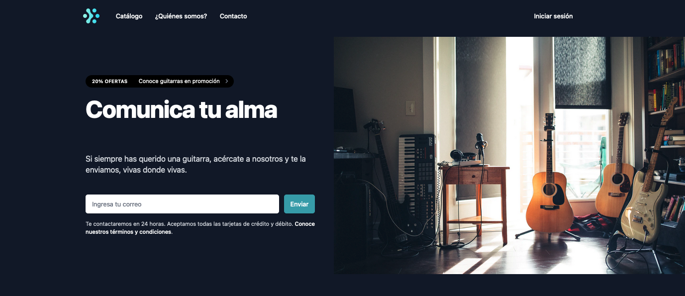

# PROYECTO 1: Landing de Negocio

## **ÍNDICE**

* [1. Intro](#1-intro)
* [2. Demo](#2-demo)
* [3. ¿Qué construirás?](#3-qu%C3%A9-construir%C3%A1s)
* [4. Objetivos de Aprendizaje](#4-objetivos-de-aprendizaje)
* [5. Requisitos](#5-requisitos-y-entregables)
* [6. Criterios de evaluación](#6-criterios-de-evaluaci%C3%B3n)
* [7. Entregas](#7-entregas)

****

## 1. Intro

Los sitios web estáticos han crecido en popularidad estos últimos años. 

Existen muchas aplicaciones como [Wix](https://wix.com) o [Squarespace](https://squarespace.com) que han aprovechado este crecimiento debido a la gran necesidad de empresas introduciéndose a Internet para presentar sus productos al mundo.

Sin embargo, hay un segmento que necesita mucha personalización, ya sea porque más adelante incluirá un sistema de registro, un área para clientes, etc. 

Es aquí donde es recomendable construirlo sin usar terceros. 

Comenzamos a trabajar con tu primer proyecto, una página web estática.

****

## 2. Demo

Puedes entrar a ver el demo en este vínculo: https://ucamp.team/

La idea es inspirarte con esta demostración de proyecto. 

**No construirás el mismo**, sin embargo, puedes examinar cómo fue construido para establecer tu estrategia.

****

## 3. ¿Qué construirás?

Este proyecto está enfocado en construir una página "landing" para un negocio.

Se te pide que sea una sola página que permita establecer:

- Mensajes del negocio (¿qué se vende?)
- Breve catálogo de productos
- Vista adaptable a móviles
- Las secciones siguientes:
  - **a. Header**
    Sección que involucra el logo y las áreas principales del sitio.
  - **b. Jumbotron**
    Sección de presentación del producto al usuario. Debe de incluir su título, descripción y un elemento para introducir tu correo.
  - **c. Blog o catálogo**
    Sección para mostrar los artículos del sitio web. O en su caso, artículos de catálogo de productos
  - **d. Adicionales**
    Secciones diversas que puedes agregar para dar mayor valor a tu sitio.
  - **e. Footer**
    Sección que incluye todas las áreas del sitio, incluyendo redes sociales.

****

## 4. Objetivos de aprendizaje

El objetivo principal de este proyecto es desarrollar una interfaz utilizando HTML y CSS, en toda su aplicación.

Aplicarás:

- Prototipado simple (baja findelidad) que mostrará tu plan de desarrollo. Puedes utilizar un dibujo a lápiz, que muestre la página que vas a construir.
- Etiquetas estándar HTML5.
- CSS, incluyendo técnicas Flexbox, CSS Grids y Responsive Web Design.

****

## 5. Requisitos y entregables

Usa esta lista para saber los requisitos mínimos del proyecto:

### GENERAL

Realizarse de manera individual

### UI
- [ ] Desarrollar prototipado simple.
- [ ] Aplicar en todo el sitio HTML semántico de estándar no.5 (HTML5).
- [ ] Aplicar tipos de selectores en CSS.
- [ ] Sección `Header`, `Jumbotron`, `footer`
- [ ] Sección de registro de usuario
- [ ] Sección artículos o catálogo
- [ ] Responsive Web Design (Vista en móviles con uso de media queries)

### CONTROL DE VERSIONES
- [ ] Crear un repositorio en GitHub y realizar mínimo 5 "commits" en tu repositorio.

### DESPLIEGUE
- [ ] Crear una URL para compartir (puedes utilizar Netlify o GitHub Pages)
- [ ] Colocar descripción dentro del repositorio

### ENTREGA A TIEMPO
- [ ] Entregar a tiempo el proyecto.

## 6. Criterios de evaluación

A partir de los requisitos, tu % estará definido de esta forma:

| ÁREA       | % DEL TOTAL |
| ------------- |:-------------:|
| UI      | 70%     |
| CONTROL DE VERSIONES      | 5%     |
| DESPLIEGUE | 10%      |
| ENTREGA A TIEMPO | 15%      |

****

## 7. Entregas

- **Definición de fechas.** Habla con tus coaches sobre el periodo de entregas del proyecto.

- **Cumple con los requisitos y entregables.** Debes verificar que cumplas con todo lo que listamos en esta sección y tomes en cuenta el tiempo establecido para ello, ya que de esto depende que obtengas tu insignia.

